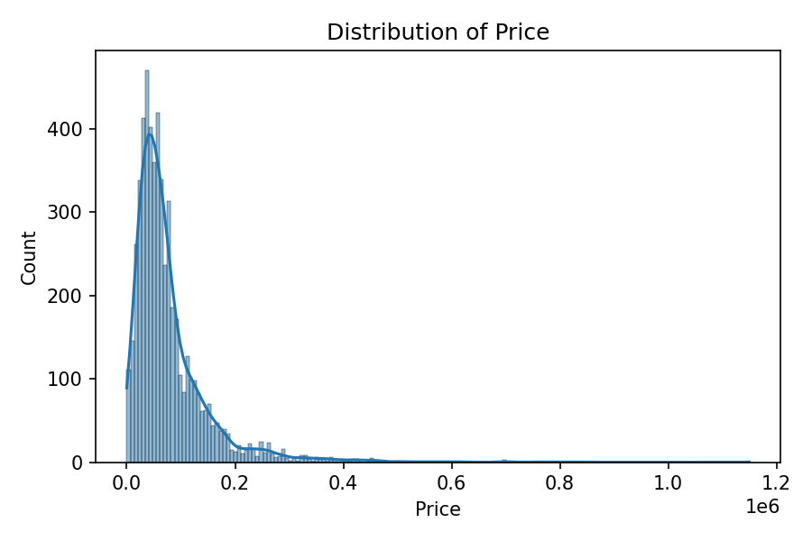
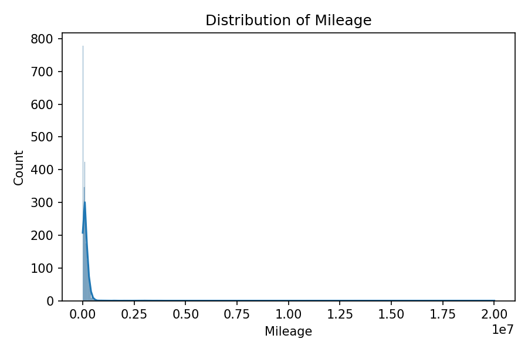
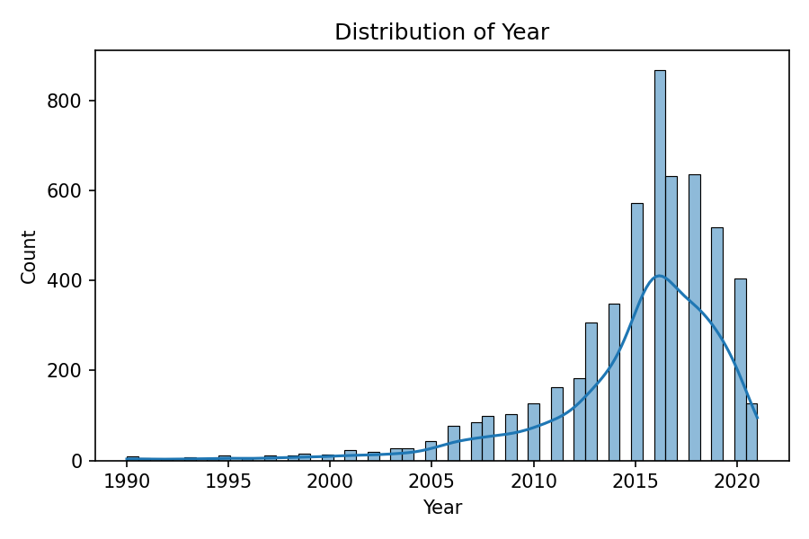
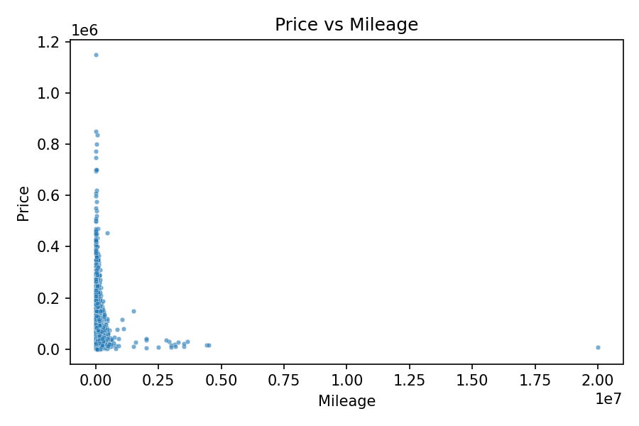

# Title
Machine Learning Reveals Determinants of Used Car Prices in Saudi Arabia

# Author Information
Saleh alhuqayl
Correspondence: email saleh@alhuqayl.com

# Abstract
Transparent pricing in the used car market is essential for buyers, sellers, and policy makers. We analyze a curated dataset of 5,482 used car listings from Saudi Arabia to model prices and quantify the role of brand, model type, year, mileage, and region. After standardized preprocessing, we benchmark linear and non-linear models. XGBoost achieves the best test performance (RMSE 13,728 SAR; R^2 0.965), indicating substantial non-linear effects. Mileage and vehicle age strongly influence price, with brand and model type providing additional signal. Our results show that a simple, reproducible pipeline can deliver accurate price predictions and interpretable insights, laying the groundwork for fairer, data-driven valuation in regional auto markets.

# Main Text
Demand for transparent valuation in used car markets is growing rapidly, driven by digital platforms and heightened consumer expectations. Pricing varies with brand, model, age, usage, and geographic factors, but publicly-available valuation tools often lag local market dynamics. We investigate the Saudi Arabian used car market using structured listings containing core attributes (make, model type, year, mileage, region, fuel, gear type, engine size, options), and two engineered variables (vehicle age and price per kilometer). We standardize text fields, resolve invalid values, and remove rows with missing target values.

We evaluate linear baselines (Ridge, Lasso) and non-linear models (Random Forest, XGBoost) using a consistent split with quantile-binned stratification on the target to stabilize regression splits. The best-performing model (XGBoost) achieves RMSE 13,728 SAR and R^2 0.965 on the held-out test set, substantially outperforming linear baselines (RMSE ~40,800; R^2 ~0.69) and Random Forest (RMSE 17,172; R^2 0.945). These results indicate that non-linear interactions—especially among mileage, vehicle age, brand, and model type—are crucial for accurate pricing.

Simple distributional checks show right-skew in prices and broad mileage spread, motivating transformations for linear models and robust handling of outliers. Scatter plots confirm a negative relationship between mileage and price. We recommend XGBoost as the primary model and propose adding SHAP-based explanations to quantify the marginal effect of top features and to validate fairness across brands and regions.

Our work demonstrates that a compact, reproducible ML pipeline can deliver high accuracy using standard features and minimal tuning. With the full dataset (≈35k rows) and further hyperparameter search, the system can improve and generalize more broadly. The approach is easily transferable to other regions with minor adaptation to categorical encodings and business rules.

# Figures

# Methods
## Data
We use `data/processed/usedcars_clean.csv` (5,482 rows, 15 columns) derived from raw listings. We standardize string fields, remove invalid `Price` (=0), bound plausible `Year` and `Mileage`, and add `Vehicle_Age` and `Price_per_km`.

## Preprocessing
Categoricals are one-hot encoded (with a limit on high-cardinality features), and numeric features are standardized for linear models. We split data into train/validation/test with a fixed random seed (42), approximating stratification via target quantile bins.

## Models
Ridge and Lasso regression form baselines. Random Forest and XGBoost capture non-linearities. All models are implemented as `sklearn` Pipelines with a shared preprocessing block; XGBoost uses histogram-based trees.

## Evaluation
We report RMSE, MAE, and R^2 on validation and test splits. Final test results are shown in the table below.

# Results Table (Test Set)

| Model | RMSE (SAR) | MAE (SAR) | R^2 |
|---|---:|---:|---:|
| Ridge | 40,756 | 23,598 | 0.689 |
| Lasso | 40,833 | 23,596 | 0.688 |
| Random Forest | 17,172 | 6,457 | 0.945 |
| XGBoost | 13,728 | 5,432 | 0.965 |

# Computational Details
Experiments run on CPU with Python 3.12. Core libraries: pandas, numpy, scikit-learn, xgboost, matplotlib, seaborn, joblib. Code and scripts are organized under `src/` and `scripts/`. Models, metrics, and figures are saved under `output/` and mirrored to `data/output/`.

# Code Availability
Code is included in this repository under `src/` and `scripts/`.
